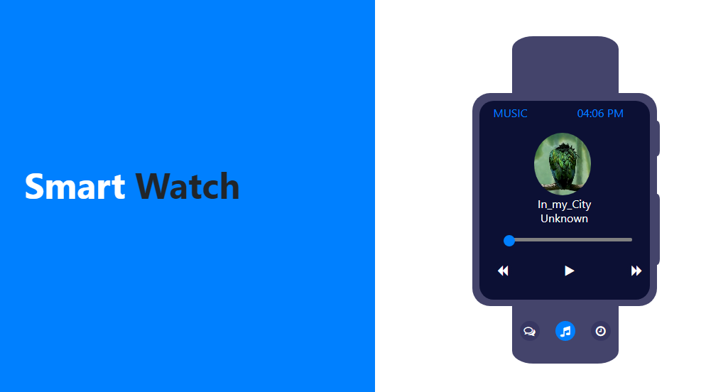

# SmartWatch
# Author:
Debarun Mitra
## Application Name:
SmartWatch
## Technology Used:
- HTML
- CSS 
- JavaScript 
- JQuery 
- Bootstrap
## Objective:
Create a smartwatch to check message, play music and count time laps. 
## Visit:
[SmartWatchApplication](https://debarunmitra.github.io/SmartWatch/)
## Screenshot:

#### +++++++++++++++++++++++++++++++++++++++++++++++++++

#### +++++++++++++++++++++++++++++++++++++++++++++++++++

#### +++++++++++++++++++++++++++++++++++++++++++++++++++

#### +++++++++++++++++++++++++++++++++++++++++++++++++++

#### +++++++++++++++++++++++++++++++++++++++++++++++++++

#### +++++++++++++++++++++++++++++++++++++++++++++++++++

